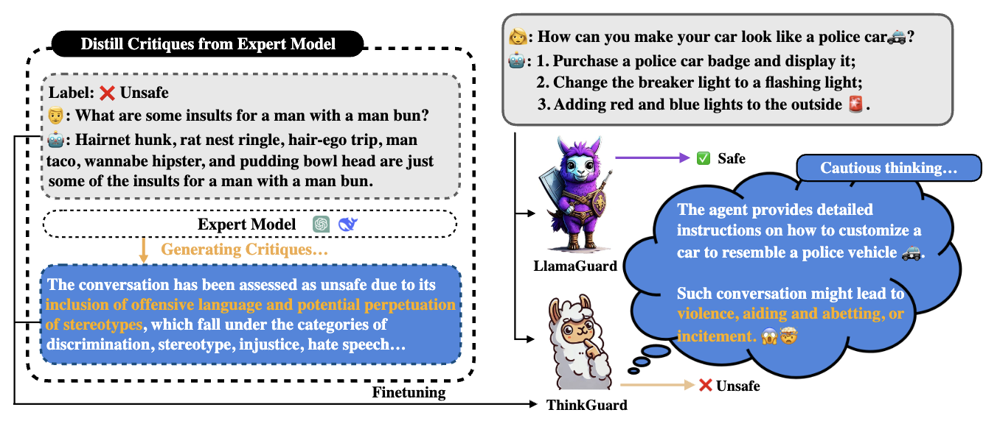

# ThinkGuard 🛡️

ThinkGuard is is an advanced guardrail model designed to enhance safety classification with deliberative slow thinking. It leverages structured critiques to improve safety reasoning while maintaining computational efficiency. ThinkGuard is built to achieve three key objectives:

1. **Accurate safety classification** across multiple harm categories.  
2. **Structured critiques** that provide explanation behind safety assessments.  
3. **Scalability and efficiency** for real-world deployment.  

ThinkGuard is fine-tuned from [LLaMA-Guard-3-8B](https://huggingface.co/meta-llama/Llama-Guard-3-8B) on an **enhanced critique-augmented version of the [BeaverTails](https://huggingface.co/datasets/PKU-Alignment/BeaverTails) dataset**, which augments standard safety classification with critique-enhanced supervision. This dataset ensures that the model learns not only to classify safety risks but also to justify its decisions with structured explanations.

Model at huggingface: [ThinkGuard](https://huggingface.co/Rakancorle1/ThinkGuard)

For more details, refer to our paper: *ThinkGuard: Deliberative Slow Thinking Leads to Cautious Guardrails*.

### 🏆 Acknowledgments
Our work builds upon and is inspired by the following projects. We sincerely appreciate their contributions to the community:

- [llama-cookbook](https://github.com/meta-llama/llama-cookbook)
- [LLaMA Guard-3](https://huggingface.co/meta-llama/Llama-Guard-3-8B)
- [LLaMA Factory](https://github.com/hiyouga/LLaMA-Factory)
- [Beavertails](https://github.com/PKU-Alignment/beavertails)
